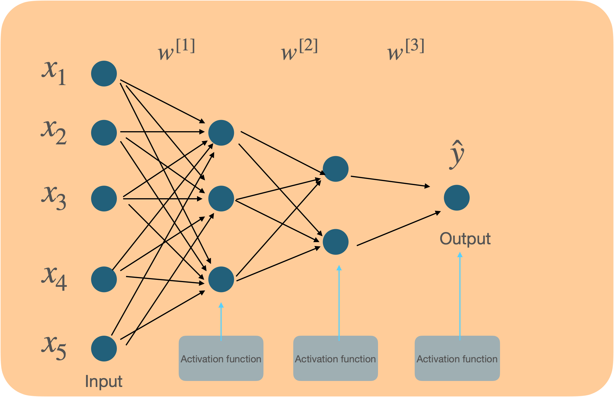
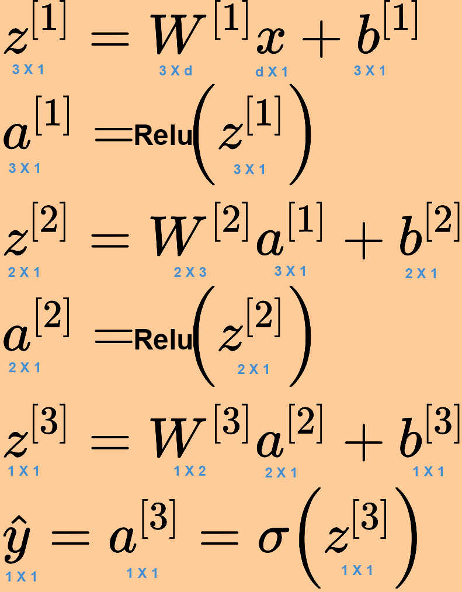

# 前馈神经网络 Feed-forward Neural Networks

对应的Jupyter Notebook文件，在 [Feed-forward Neural Networks](https://github.com/limingluo/Deep-Learning/blob/main/docs/notebooks/Feed-Forward-Neural-Networks.ipynb)    [下载到本地](https://limingluo.github.io/Deep-Learning/notebooks/Feed-Forward-Neural-Networks.ipynb)

## 描述


最原始也是最基础的神经网络，本质上就是多层感知机 Multi-layer Perceptron，多个神经元之间进行**全连接**，只是需要根据解决问题的不同选择合适的激活函数。



在上图的前馈神经网络中，除了输入层外，每一个神经元都有一个激活函数，在感知机中我们采用了符号函数，而在神经网络中，我们可以根据问题的需求采取不同的激活函数，每个神经元的激活函数都可以不同，常用的有Sigmoid函数、Sign函数、Softmax函数、ReLu函数。

在输入层（Input Layer）和输出层（Output Layer）之间的神经元属于隐藏层（Hidden Layer）。我们把上图中的神经网络叫做三层神经网络（Three layer neural network），因为习惯上输出层是不计入网络层数的。

在隐藏层中，神经元接受上一层的所有神经元输入的变量，加权后再经过激活函数的处理得到一个输出，然后再与同一层神经元的输出一起输入到下一层神经元，最后传递到输出层得到最终的结果。

- **为什么叫做隐藏层？**

  隐藏层的层数以及每层的单位数是人为设计的，其中的具体参数也是在训练过程中得到，在数据集中的输入和输出都不会体现，所以叫做隐藏层。

- **为什么需要隐藏层？**
  
    隐藏层从数据中抽象出更深层次的特征，可以学习到原本在数据中没能直接体现的特征，
    
    比如识别一张猫的图片，输出的只是图片的RGB颜色信息，而通过中间隐藏层的学习，神经网络能够学习到其中的深层次表达，越到后面的隐藏层，学到的内容越精细。比如第一个隐藏层中有神经元可能学到了猫的大概轮廓是什么样，第二层的神经元开始知道耳朵、鼻子、眼睛的轮廓，最后结合这些特征能够判断图片是否是猫。
    
    比如预测房价的问题，输入的特征是房屋的面积、卧室数量、邮编、邻居的财富总值，线性回归中我们直接找各个特征和房价之间的关系，而在神经网络中，我们可以学习到更深层次的信息，比如结合邮编和邻居财富总值我们知道当地小学的教学质量，这些更深层次的特征能对输出产生更大的影响。
    
- 怎么确定需要多少隐藏层，每个隐藏层需要多少神经元？
  
    一般需要根据经验进行不断尝试和调整
    

要进行神经网络的训练，需要基于给定的输入和输出以及神经网络的结构，计算出每一个隐藏层中的所有权重，为什么找出权重之间的关系，我们先看看神经网络的正向过程是怎么样的。

## 模型

以判断一张图片是不是猫的问题为例


### 输入特征

图片由像素点构成，每个像素点用R、G、B三个数值来表现其颜色，所以可以用图片上每一个像素点的R、G、B数值作为特征，则输入的特征数量为 像素长度 X 像素宽度 X 3，如下图的图片为4X4像素，则输入一共有4X4X3 = 48个特征，具体为$[212, 122, 23, ..., 24, 67, 98,..., 33, 46, 111, ...]$


给定一个有m个样本、d个特征的数据集$X=\{x^{(1)},x^{(2)},...,x^{(m)}\}$

$x^{(i)}=\{x_0^{(i)},x_1^{(i)},x_2^{(i)},...,x_d^{(i)}\}$，表示每一个样本

则

$x^{(i)}$是个$(d, 1)$的向量：

$x^{(i)} = \left[\begin{array} {ccc}  x^{(i)}_1 \\ x^{(i)}_2 \\ \vdots \\ x^{(i)}_d\end{array}\right] $

$X$是个$(d,m)$的矩阵：

$X=\left[\begin{array}{ccc}
\vdots & \vdots & \vdots & \vdots \\
x^{(1)} & x^{(2)} & \cdots & x^{(m)} \\
\vdots & \vdots & \vdots & \vdots
\end{array}\right] $

注意：这里使用的输入$X$的形状为$(特征数, 样本数)$，一些算法实现中输入$X$的形状为$(样本数, 特征数)$，不同的形状在后面进行计算时需要进行调整。

### 输出结果

输出$\hat{y}=\{0, 1\}$，分别代表是猫、不是猫两种输出。

### 模型架构


其中隐藏层和输出层的激活函数根据数据分布和任务类型选择，比如上图的神经网络的激活函数均为Sigmoid，看起来就像是很多个逻辑回归模型叠加起来。

在每个神经元中，都经历了一次线性计算加上一次$Sigmoid$计算，输出$a$并传入到下一层中。

-16444654319641.jpg)

## 参数初始化

第$l$层的整体权重为$W^{[l]}$，每层中矩阵$W$的形状取决于上一层中输出$A$（或$X$）的神经元个数（或特征数）以及当前层中神经元的个数，形状为(当前层数, 上一层数)，数值可以随机初始化，然后通过反向传播得到最终的值。

第$l$层的整体偏置为$b^{[l]}$，每层中矩阵$b$的形状取决于当前层中神经元的个数，形状为(当前层数, 1)，数值一般初始为0，然后通过反向传播得到最终的值。

比如对于上图中的神经网络，

第0层（输入层）共有d个特征，所以输入的每个样本的矩阵$x^{[i]}$形状为$(d, 1)$，整个训练集的输入$X$的形状为$(d, m)$；

第1层中$W{[1]}$的形状为$(3, d)$，3来自于第1层中神经元的个数，$d$来自于第0层中的神经元个数（初始特征数），$b^{[1]}$的形状为$(3, 1)$，3来自于第1层中神经元的个数，这样得到该层输出$z^{[1]}$和$a^{[1]}$的形状为$(3,1)$，$Z^{[1]}$和$A^{[1]}$的形状为$(3, m)$；

第2层中$W{[2]}$的形状为$(2, 3)$，2来自于第2层中神经元的个数，$3$来自于第1层中的神经元个数，$b^{[2]}$的形状为$(2, 1)$，2来自于第1层中神经元的个数，这样该层输出$z^{[2]}$和$a^{[2]}$的形状为$(2,1)$，$Z^{[1]}$和$A^{[1]}$的形状为$(2, m)$；

第3层（输出层）中$W^{[3]}$的形状为$(1, 2)$，1来自于第3层中神经元的个数，$2$来自于第2层中的神经元个数，$b^{[3]}$的形状为$(1, 1)$，1来自于第3层中神经元的个数，这样该层输出$z^{[3]}$和$a^{[3]}$的形状为$(1,1)$，$a^{[3]}$也就是最终预测的结果$\hat{y}$，$Z^{[1]}$和$A^{[1]}$的形状为$(1, m)$

接下来的我们通过代码构建一个L层的深度前馈神经网络，在隐藏层全部使用Relu激活函数，输出层使用Sigmoid激活函数。

```python
# 初始化参数函数，输入神经网络的层数、神经元信息，输出初始化后的权重和偏置
def initialise_parameters(layer_dims): # layer_dims = [输入层特征数，第一层神经元数，第二层神经元特征数...，输出层特征数]，表现出每层有多少神经元
    L = len(layer_dims) # 计算神经网络一共多少层
    parameters = {} # 创建参数字典，存储各参数的值

    for l in range(1, L):
        parameters["W" + str(l)] = np.random.randn(layer_dims[l] , layer_dims[l-1]) * 0.01 # 计算各层权重的值并存储在parameters中
        parameters["b" + str(l)] = np.random.randn(layer_dims[l], 1) # 计算各层偏置的值并存储在parameters中
    return parameters
```

## 前向传播

假设是一个三层的神经网络，$layer\_dims=(d,3,2,1)$对于每个样本，正向计算过程如下：



```python
# 定义两个激活函数

def sigmoid(Z):   
    A = 1/(1+np.exp(-Z))  
    return A

def relu(Z):
    
    A = np.maximum(0,Z)
    
    return A

# 前向传播函数。输入训练数据X和参数W、b，计算后输出预测值以及中间产生的输出，以用于反向传播
def forward_propagation(X, parameters):
    caches = {} # 数组caches，存储前向传播过程中产生的中间输出
    L = len(parameters) // 2 # 因为parameters里包括隐藏层和输出层的W和b，长度除以二就能得到神经网络层数
    caches["A0"] = X # 先存入输入的数据X
    for l in range(1, L):
        A = caches["A" + str(l - 1)] 
        caches["Z" + str(l)] = np.dot(parameters["W"+str(l)], A) + parameters["b"+str(l)] # 计算进入下一层时线性函数的结果Z并存储
        caches["A" + str(l)] = np.maximum(caches["Z" + str(l)], 0) # 计算上一层的输出A并存储
        #print(caches["A" + str(l)].shape)
    ZL = np.dot(parameters["W"+str(L)], caches["A" + str(L-1)]) + parameters["b"+str(L)]
    Y_hat = sigmoid(ZL) # 得到输出层的数据，也就是预测值
    return Y_hat, caches
```

## 计算损失

通过用现在的参数进行前向传播，我们计算出了预测值$\hat Y$，于是可以通过代价函数计算损失。

$J = -\frac{1}{m} \sum_{i=1}^{m}\left(y^{(i)} \log \left(\hat{y}^{(i)}\right)+\left(1-y^{(i)}\right) \log \left(1-\hat{y}^{(i)}\right)\right)$

````python
def compute_cost(Y, Y_hat):
    m = Y.shape[1] # 计算总样本数
    cost = - 1 / m * (np.dot(np.log(Y_hat), Y.T) + np.dot(np.log(1-Y_hat), (1-Y).T)) # 计算损失
    cost = np.squeeze(cost) # 确保损失为一维形状
    return cost
````


## 反向传播

根据最大似然估计，定义代价函数 

$J(\hat{y},y)=\frac {1}{m}\sum_{i=1}^m-[y^{(i)}\log\hat{y}^{(i)}+(1-y^{(i)})\log(1-\hat{y}^{(i)})]$

则损失函数为：$L(\hat{y},y)=-[y^{(i)}\log\hat{y}+(1-y)\log(1-\hat{y})]$

***注：***代价函数是指整个训练集上的平均损失，损失函数是指训练集中单个样本的损失。

我们要找到理想的权重$W^{[1]},W^{[2]},W^{[3]}$和偏置$b^{[1]},b^{[2]},b^{[3]}$，需要用梯度下降法不断更新权重（建议参考《机器学习》笔记中梯度下降的部分），于是我们需要找到损失函数关于权重和参数的导数，它们之间是有关联的，层层递进，求导的时候从后往前运算会简单很多。

对于单个样本，根据上面的损失函数$L(\hat{y},y)$以及$a^{[3]} = \hat{y}$，有：

$\begin{aligned}
\frac{\partial L(y, \hat{y})}{\partial a^{[3]}} &=-\left[\frac{y}{a^{[3]}}+\frac{-(1-y)}{1-a^{[3]}}\right] \\
&=\frac{1-y}{1-a^{[3]}}-\frac{y}{a^{[3]}} \\
&=\frac{a^{[3]}(1-y)-\left(1-a^{[3]}\right) y}{a^{[3]}\left(1-a^{[3]}\right)} \\
&=\frac{a^{[3]}-y}{a^{[3]}\left(1-a^{[3]}\right)}
\end{aligned}$


根据$a^{[3]}=\sigma(z^{[3]})=\frac{1}{1+e^{-z^{[3]}}}$，有：

$\begin{aligned}
\frac{\partial a^{[3]}}{\partial z^{[3]}} &=-\frac{e^{-z^{[3]}} \times(-1)}{\left(1+e^{-z^{[3]}}\right)^{2}} \\
&=\frac{1+e^{-z^{[3]}}-1}{\left(1+e^{-z^{[3]}}\right)^{2}} \\
&=\frac{1}{\left(1+e^{-z^{[3]}}\right)}-\frac{1}{\left(1+e^{-z^{[3]}}\right)^{2}} \\
&=a^{[3]}-a^{[3]^{2}}\\
&=a^{[3]}(1-a^{[3]})
\end{aligned}$

则：

$\begin{aligned}
\frac{\partial L(y, \hat{y})}{\partial z^{[3]}} &=\frac{\partial L(y, \hat{y})}{\partial a^{[3]}} \cdot \frac{\partial a^{[3]}}{\partial z^{[3]}} \\
&=\frac{a^{[3]}-y}{a^{[3]}\left(1-a^{[3]}\right)} \cdot a^{[3]}\left(1-a^{[3]}\right) \\
&=a^{[3]}-y
\end{aligned}$


根据$z^{[3]}=W^{[3]}a^{[2]}+b^{[3]}$，有：$\frac{\partial z^{[3]}}{\partial w^{[3]}}=a^{[2]}$，$\frac{\partial z^{[3]}}{\partial b^{[3]}}=1$，$\frac{\partial z^{[3]}}{\partial a^{[2]}}=W^{[3]}$

**则：**

 $\begin{aligned}
\frac{\partial L(y, \hat{y})}{\partial W^{[3]}} &=\frac{\partial L(y, \hat{y})}{\partial z^{[3]}} \cdot \frac{\partial z^{[3]}}{\partial W^{[3]}} \\
&=(a^{[3]}-y){a^{[2]}}^T
\end{aligned}$

$\begin{aligned}
\frac{\partial L(y, \hat{y})}{\partial b^{[3]}} &=\frac{\partial L(y, \hat{y})}{\partial z^{[3]}} \cdot \frac{\partial z^{[3]}}{\partial b^{[3]}} \\
&=a^{[3]}-y
\end{aligned}$

$\begin{aligned}
\frac{\partial L(y, \hat{y})}{\partial a^{[2]}} &=\frac{\partial L(y, \hat{y})}{\partial z^{[3]}} \cdot \frac{\partial z^{[3]}}{\partial a^{[2]}} \\
&=(a^{[3]}-y)W^{[3]}
\end{aligned}$

根据$a^{[2]}=ReLu(z^{[2]})=max(z^{[2]},0)$，有：


则：$\begin{aligned}
\frac{\partial L(y, \hat{y})}{\partial z^{[2]}} &=\end{aligned}(a^{[3]}-y)W^{[3]} \cdot ReLu\_backward(Z^{[2]})$


根据$z^{[2]}=W^{[2]}a^{[1]}+b^{[2]}$，有：$\frac{\partial z^{[2]}}{\partial W^{[2]}}=a^{[1]}$，$\frac{\partial z^{[2]}}{\partial b^{[2]}}=1$，$\frac{\partial z^{[2]}}{\partial a^{[1]}}=W^{[2]}$

则：

$\begin{aligned}
\frac{\partial L(y, \hat{y})}{\partial W^{[2]}} &=\frac{\partial L(y, \hat{y})}{\partial z^{[2]}} \cdot \frac{\partial z^{[2]}}{\partial W^{[2]}}\\&=\frac{\partial L(y, \hat{y})}{\partial z^{[2]}} \cdot a^{[1]}\\
&=(a^{[3]}-y)W^{[3]} \cdot ReLu\_backward(Z^{[2]})\cdot a^{[1]}
\end{aligned}$

$\begin{aligned}
\frac{\partial L(y, \hat{y})}{\partial b^{[2]}} &=\frac{\partial L(y, \hat{y})}{\partial z^{[2]}} \cdot \frac{\partial z^{[2]}}{\partial b^{[2]}}\\
&=\frac{\partial L(y, \hat{y})}{\partial z^{[2]}} \\&=(a^{[3]}-y)W^{[3]} \cdot ReLu\_backward(Z^{[2]})
\end{aligned}$

以此类推，可以得到$\frac{\partial L(y, \hat{y})}{\partial W^{[1]}} $和$\frac{\partial L(y, \hat{y})}{\partial b^{[1]}} $

规律是：在隐藏层中： 

$dW^{[l]}=np.dot(dZ^{[l]},A^{[l-1]}.T)/m$

$db^{[l]} = np.sum(dZ^{[l]},axis=1)/m$

$dA^{[l-1]} = np.dot(dW^{[l]}.T, dZ^{[l]})$

$dZ^{[l-1]} = dA^{[l-1]}*ReLu\_backward(Z^{[l-1]})$

在输出层中：

$dZ^{[L]}=Y\_hat - Y$

```python
def sigmoid_backward(dA, Z):
    
    s = 1/(1+np.exp(-Z))
    dZ = dA * s * (1-s)
    
    return dZ

def relu_backward(dA, Z):
    dZ = np.array(dA, copy=True) 
    dZ[Z <= 0] = 0
    return dZ

def backward_propagation(Y_hat, Y, caches, parameters):
    m = Y_hat.shape[1] # 神经网络层数
    L = len(parameters) // 2
    grads = {} # 存储中间产生的梯度的字典
    grads["dZ"+str(L)] = Y_hat - Y # 先存储关于输出层中Z的梯度
    for l in range(L, 0,-1):

        grads["dW" + str(l)] = 1/m * np.dot(grads["dZ"+str(l)], caches["A"+str(l-1)].T)
        grads["db" + str(l)] = 1/m *  np.sum(grads["dZ"+str(l)], axis=1, keepdims=True)

        if l > 1:
            grads["dA" + str(l-1)] = np.dot(parameters["W"+str(l)].T, grads["dZ"+str(l)])
            grads["dZ"+str(l-1)] =  relu_backward(grads["dA" + str(l-1)], caches["Z"+str(l-1)] )
    return grads
```


## 更新参数

现在得到了损失函数$L(y,\hat{y})$关于各层中$W$和$b$的导数，就可以通过梯度下降$W=W-\alpha \frac{\partial L(y,\hat{y})}{\partial W}$以及$b=b-\alpha \frac{\partial L(y,\hat{y})}{\partial b}$迭代更新，最终得到最理想的参数，其中$\alpha$是学习速率，决定了更新的速度。

```python
def update_parameters(parameters, grads, learning_rate):
    L = len(parameters) // 2 # 神经网络的总层数
    for l in range(1, L + 1):
        parameters["W"+str(l)] = parameters["W"+str(l)] - learning_rate * grads["dW"+str(l)]
        parameters["b"+str(l)] = parameters["b"+str(l)] - learning_rate * grads["db"+str(l)]

    return parameters
```


## 训练架构

传入输入特征、输入标签、神经网络结构、迭代次数、学习率，经过参数初始化以及很多次的前向传播、计算损失、反向传播、更新参数后，最终返回训练后的参数用于预测。

```python
def dnn_model(X, Y, layer_dims, iterations, learning_rate):
    parameters = initialise_parameters(layer_dims) # 初始化参数
    np.random.seed(1)
    for i in range(iterations):
        Y_hat, caches = forward_propagation(X, parameters) # 前向传播
        cost = compute_cost(Y, Y_hat) # 计算损失
        if i % 100 == 0:
            print("第", i, "次迭代的损失：", cost)
        grads = backward_propagation(Y_hat, Y, caches, parameters) # 反向传播
        parameters = update_parameters(parameters, grads, learning_rate) # 更新参数
    return parameters
```

## 预测

获得训练好的参数后，我们可以预测训练集、测试集的数据，看看是否与已有标签的差距，计算精度等。

```python
# 预测函数
def predict(parameters, X):
    # 传入训练好的参数以及测试集的特征
    Y_hat,caches = forward_propagation(X, parameters) # 前向传播以得到预测值Y_hat
    predictions =  Y_hat  > 0.5 # 如果预测概率大于0.5输出1（狗），否则输出0（猫）
    (np.dot(train_y, predictions.T) + np.dot(1 - train_y, (1 - predictions).T)) / float(train_y.size)
    return predictions #返回预测的值
        
    return p

# 计算精度Accuracy函数
def accuracy(Y_hat, Y):
    accuracy = (np.dot(Y, Y_hat.T) + np.dot(1 - Y, (1 - Y_hat).T)) / float(Y.size) * 100
    accuracy = float(accuracy)
    return accuracy
```

